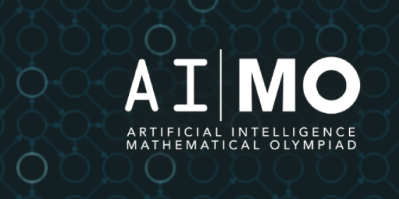

# aimo

Solve national-level math challenges using artificial intelligence models

https://www.kaggle.com/competitions/ai-mathematical-olympiad-prize

## Docs

[https://ironbar.github.io/aimo](https://ironbar.github.io/aimo)

## Code structure

     |_ aimo: library with code developed for the challenge
     |_ forum: all the scripts and notebooks taken from the forum
     |_ logs: folder for storing all kind of stats and logs. For example the
     score of each model, results from experiments
     |_ notebooks: jupyter notebooks made during the challenge. They start by number for easier sorting.
     |_ reports: documents made during the challenge according to CRISP-DM methodology
     |_ tests: folder with tests for the library
     |_ data: folder with light data from the challenge
     |_ rules: the official rules of the challenge
     |_ scripts: scripts made during the challenge for training, data processing...
