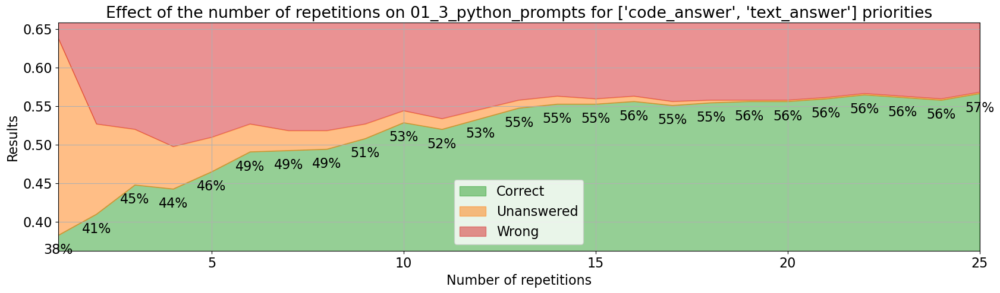
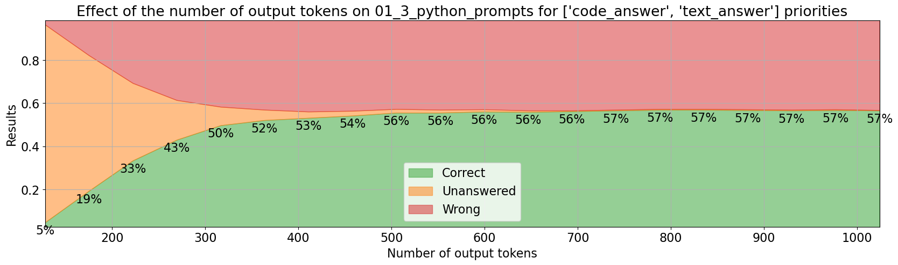
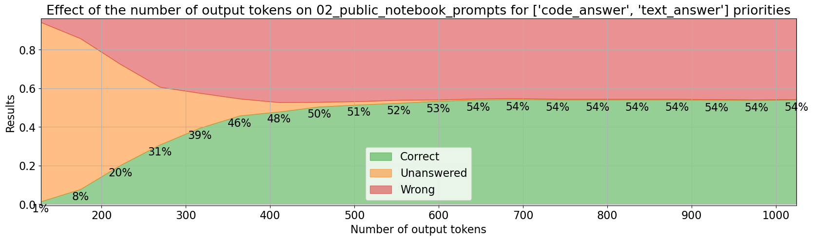
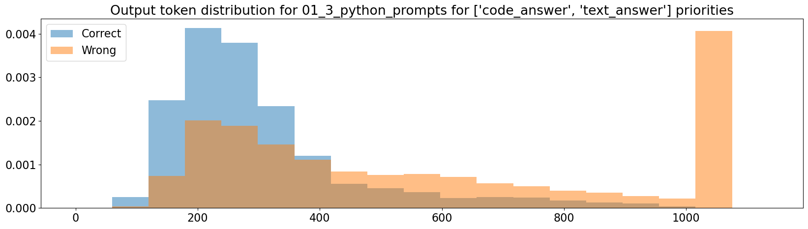

# Iteration 2. MATH dataset

_06/05/2024_

## Goal

Can we improve LB score by focusing on MATH dataset?

## Motivation

There is a [conversation](https://www.kaggle.com/competitions/ai-mathematical-olympiad-prize/discussion/499464) on the forum that suggests that the correlation between train score and
leaderboard score is very weak. The host said:

> 10 public problems were intentionally chosen to be at or above average difficulty. 50 test problems have a range of difficulties from relatively simple problems to those approaching national Olympiad level

This implies that claiming the overall prize winner is going to be very hard, because progress on the leaderboard
is not expected to be linear because the difficulty of the problems is increasingly harder.

Futhermore the train set is very small, just 10 problems. Using a bigger dataset for validation will
allow to measure small improvements.

## Development

### About the MATH dataset

MATH is a new dataset of 12,500 challenging competition mathematics problems. Each problem in MATH has a full step-by-step solution which can be used to teach models to generate answer derivations and explanations.

The problems belong to these categories: algebra, counting and probability, geometry, intermediate algebra, number theory, prealgebra and precalculus. They also have levels of difficulty from 1 to 5. The problems are
written in latex and they have also a text response in latex.

The proposed division has 7500 train problems and 5000 test problems. If I were to evaluate all the
test problems once using Kaggle's hardware it would take 90 hours (current submission takes 9 hours to solve 50 problems with 10 repetitions each). So this is a problem. Evaluation is slow. But it is a problem that
all the teams are going to have. And I could use my resources from consultant job to pay for computation.
The prize is 130k$, it might be worth spending a few thousand dollars in evaluation to get the prize.
But I have to first find something that works and is scalable.

Links:

- [Original repo of the MATH dataset](https://github.com/hendrycks/math?tab=readme-ov-file)
- [Kaggle dataset with MATH and GSM8K datasets](https://www.kaggle.com/datasets/alejopaullier/aimo-external-dataset)

#### Token len distribution


As expected the more difficult problems have longer answers and descriptions. Very beautiful graph.

#### Removing problems with non positive integer answers

I'm left with 4345 train problems and 2828 test problems. The distribution of problems is more or less
balanced except for level 1 that has half the problems than the other categories.

### Evaluating the MATH dataset

If making a single prediction per problem evaluating 566 test problems in 85 minutes. That is around 6 problems per minute.
GPU usage is high, so I don't think there is much room for improvement. I can run two evaluations in parallel
with good GPU usage.

Uncertainty in the results is big, f.e. for an accuracy of 54% the uncertainty is around 4%. Using the whole
test set will reduce the uncertainty below 2%, but evaluation would take 7 hours on my PC.

However if I only evaluate the problems of difficulty level 5 then evaluating 580 problems takes around 131 minutes.

### About inference loop repetitions

Sometimes I have seen repetitions on inference, f.e. the following text was repeated multiple times:

```
We can then try each factor to see if it gives us a valid solution for $x$ and $y$.\n\nIf we try $10x + 15 = 1$, we get $10x = -14$, which is not possible since $x$ must be a positive integer.\n\nIf we try $10x + 15 = 2$, we get $10x = -13$, which is not possible.\n\nIf we try $10x + 15 = 7$, we get $10x = -8$, which is not possible.\n\nIf we try $10x + 15 = 14$, we get $10x = -1$, which is not possible.\n\nIf we try $10x + 15 = 49$, we get $10x = 34$, so $x = 3.4$, which is not an integer.\n\nIf we try $10x + 15 = 98$, we get $10x = 83$, so $x = 8.3$, which is not an integer.\n\nSo, we must have made a mistake somewhere. Let's go back and check our work.\n\nWe factored the left side of the equation as $(10x + 15)(y - 4) = 98$.\n\n
```

I have seen that Huggingface has tools such as [repetition_penalty](https://discuss.huggingface.co/t/transformers-repetition-penalty-parameter/43638) or `no_repeat_ngram_size`.

However using those options can be dangerous. In the response some tokens will be repeated very often, using a penalty on them will hurt the accuracy of the model. Documentation is not
clear and I believe it is better to play with the temperature of the model than touching
those parameters.

### Optimal stop criteria for self-consistency

On the public notebook that won the early prize the stopping criteria was `count > sqrt(n_tries`. When
I saw it I didn't liked and replaced it with a simpler majority check, f.e. if I was running 8 repetitions
I required the most voted answer to be 4 to stop sampling more answers. But I felt that it was not
a good allocation of resources.

I have implemented a better stop criteria based on statistics. My intuition says that I should
stop sampling more answers when the frequency of the most voted answer is statistically higher
than the second most voted answer. The beauty of this definition is that I can choose how much
statistical confidence I want to use: 80%, 90%, 95%...


I found this [paper](https://arxiv.org/html/2401.10480v1) about the topic, but didn't have the time to read it because I believe my approach
is the correct one.

### Speedup inference with P100 instead of 2xT4

Although using 2xT4 in parallel is likely to be faster than a a single P100, I could try using the P100
now because I know it is faster.

I have verified that when using 1024 output tokens on P100 I can use 1 or 2 shots, but using 3 or more
results on Out of Memory errors.

The inference speed is twice as 2xT4 as the information below shows.

```bash
P100 [19:05<00:00, 21.62s/it]
Correct: 18/53 (0.34 ± 0.13)
Unanswered: 0/53 (0.00 ± 0.00)
Wrong: 35/53 (0.66 ± 0.13)

T4x2 34/53 53/53 [42:16<00:00, 47.87s/it]
Correct: 21/53 (0.40 ± 0.13)
Unanswered: 0/53 (0.00 ± 0.00)
Wrong: 32/53 (0.60 ± 0.13)
```

It is a little bit weird because apparently the token speed generation was not so different ([18.7 vs 15.2](./Iteration_01_overfit.md#p100-vs-2xt4))

#### OOM issues with P100

```bash
2 shots
63/580 out of memory 10%
https://www.kaggle.com/code/ironbar/deepseekmath-with-code-interpreter?scriptVersionId=177616865

1 shot
0/580
https://www.kaggle.com/code/ironbar/deepseekmath-with-code-interpreter?scriptVersionId=177756625
```

Despite not having any OOM issues, the metrics are almost the same. That could point to the fact
that OOM errors might be happening similarly to achieving the max output tokens, thus not affecting the
accuracy of the model.

### Using the right evaluation

If I just want to evaluate the goodness of the base model is better to not aggregate the predictions.
For example if I make a single prediction on the 580 MATH level 5 problems I will get an uncertainty of around 4% on the accuracy metrics. If I make 4 predictions on each problem that uncertainty will drop to 2%.

In the other hand to evaluate the whole system I need to aggregate the predictions on each problem.
However this evaluation is much slower, because f.e. making 10 prediction on 50 problems will take a similar amount of time to the proposed evaluation in the previous paragraph, and the uncertainty will be huge: 13%
I need to use the whole dataset for evaluation, otherwise the uncertainty is too big. And that could take around 16 hours.

A model that has greater accuracy and less errors on individual problems evaluation will also have higher
accuracy when the inferences are aggregated per problem.

## Results

### First evaluations on MATH dataset

I have evaluated 1/5 of the test dataset in around 85 minutes.


The accuracy of the model decreases with the level of difficulty. Maybe I should focus on problems
of level 3 and above. The averaged accuracy of those categories is 42%, which equals to 21 problems solved
on the public leaderboard.

How an ideal validation set should be?

- As similar as possible to the test set. Correlation should be as high as possible. Improvements on the
  validation set should translate to improvements on the test set.
- The validation process should be as similar to the submission as possible. This implies that I should
  do many repetitions on each problem. Otherwise I won't be optimizing the same thing as in submission.
- As precise as possible. A small dataset with high uncertainty does not allow to measure small improvements.

This implies that I should select the levels with higher correlation to leaderboard, and use a lot of compute
to evaluate all the problems with a few repetitions.

### This challenge is a race in disguise

> In the event of a tie, the Submission that was entered first to the Competition will be the winner.

The private test set is tiny and thus uncertainty on the scores is very high. I have created a [notebook](https://www.kaggle.com/code/ironbar/uncertainty-private-test-score?scriptVersionId=176648016)
to estimate the effect of uncertainty.

A team with a score of just 22 will have a 30% chance of equaling or winning a team with a score of 25.
Luck will play a big role in the competition. And reaching a good score first will be very valuable.

However this is calculated with the assumption that all the problems have the same difficulty, which is likely untrue.

### Few-shot prompt sources

| few-shot source | MATH5 accuracy | LB score |
|-----------------|----------------|----------|
| MATH            | 30%            | 7        |
| AIMO train      | 51%            | 20       |
| MathInstruct    | 49%            | 21       |

Using prompts with code clearly beats the text approach. On a following iteration I should try using
RAG to find similar problems.

### Number of shots

The table below shows the evaluation on Math level 5 problems with a single inference on each.

| few-shot | runtime (min) | correct | unanswered | wrong | boxed_answers | mean code interpreter calls |
|----------|---------------|---------|------------|-------|---------------|-----------------------------|
| 1        | 131           | 34%     | 28%        | 38%   | 65%           | 0.9                         |
| 2        | 131           | 33%     | 27%        | 40%   | 70%           | 0.9                         |
| 3        | 148           | 33%     | 28%        | 39%   | 69%           | 0.9                         |
| 5        | 164           | 36%     | 27%        | 37%   | 71%           | 0.9                         |

- The changes are not significative (at least without a pairwise comparison), uncertainty is around 4%
- The only significative change is that boxed answers are more frequent

### Effect of saving KV values

I have run the exact same evaluation with and without saving KV values. The first run was 131 minutes, and without saving KV values the time grew to 139 minutes. Thus it is a small difference (at least for 1 shot).
This opens the door to using an LLM server, however memory usage was almost the same.

### Effect of quantization

I have run the same evaluation with and without quantization. It was an experiment with 2 shots from AIMO train
dataset and 4 repetitions for each problem.

| precision | runtime (min) | correct | unanswered | wrong |
|-----------|---------------|---------|------------|-------|
| 16 bit    | 469           | 39%     | 23%        | 38%   |
| 4 bit     | 783           | 40%     | 22%        | 39%   |

It seems that the quantization does not have any effect on precision, considering that the uncertainty
in the results is around 2%.

However it does affect inference speed, the model is 67% slower when quantized.

### Effect of temperature

I have made experiments with 2 shots from AIMO train dataset and 4 repetitions for each problem.
The only variation between experiments was the temperature.

| temperature | runtime (min) | correct | unanswered | wrong |
|-------------|---------------|---------|------------|-------|
| 1           | 506           | 35%     | 24%        | 40%   |
| 0.5         | 508           | 39%     | 24%        | 37%   |
| 0.25        | 483           | 40%     | 23%        | 37%   |
| 0.12        | 492           | 40%     | 23%        | 37%   |
| 0.06        | 484           | 41%     | 23%        | 35%   |
| 0           | 469           | 39%     | 23%        | 38%   |

The uncertainty of this metrics is around 2%, so temperature 1 is worse but the differences between
the other experiments might not be significative.

### Using different prompts

| prompts                            | correct | unanswered | wrong |
|------------------------------------|---------|------------|-------|
| original code prompt               | 31%     | 29%        | 40%   |
| original code prompt forced python | 36%     | 28%        | 36%   |
| original cot prompt                | 34%     | 23%        | 43%   |
| original cot prompt forced python  | 40%     | 26%        | 34%   |
| MATHCodeInstruct 2 shots           | 35%     | 22%        | 44%   |
| AIMO_train 2 shots                 | 40%     | 22%        | 38%   |
| custom prompt                      | 38%     | 25%        | 38%   |

- Forcing python clearly improves the results, thus I should be able to improve results with my prompts.
  This is achieved by starting the response with the markdown format of python code.
- No evidence that using few shot prompt gives best results, as the paper already says.
- AIMO train prompts are better than MATHCodeInstruct, my hypothesis is because they favour to use code
  because the response starts with python code. On MATHCodeInstruct the response can start with some text.

The uncertainty of this metrics is around 4%, and this are individual problem scores (no self-consistency results)

¿Could I craft better prompts that achieve more correct results and less wrong predictions?

### Full evaluation

I have prepared a full evaluation of the 580 MATH level 5 problems using the same configuration as the submission: 25 repetitions and a confidence level of 95% for stopping doing inference and returning an answer. I have done
two evaluations:

1. Using the prompts from the early prize public notebook. The evaluation has taken 42 hours (21 hours on 2x3090 GPUs)
2. Using those prompts with forced python code and one custom prompt. The evaluation has taken 34 hours (17 hours on 2x3090 GPUs)

| prompts       | MATH level 5 accuracy | LB score       |
|---------------|-----------------------|----------------|
| early prize   | 54%                   | 16, 21         |
| forced python | 57%                   | 15, 17, 18, 17 |

The uncertainty on MATH is around ±4%, despite evaluating on 580 problems. On leaderboard there is an
uncertainty of ±7 problems. Notice that uncertainty is not equal to variability. We could have a deterministic
system that always scores the same on the public test set, but the expected score on the private test set is
related to the uncertainty.

I have run a pairwise comparison and there is no significative difference between the results.

This is very interesting, because in the previous section we saw significative differences when using
a single repetition for evaluation. Thus we see differences on a single repetition but no difference
when using multiple repetitions. **This implies that we need to do the costly full evaluation to optimize our system**.

#### What is the effect of the number of repetitions?




In both cases using more repetitions improves the results as expected. Also there are diminishing
returns as expected as well.

#### What is the effect of the number of output tokens?





These plots suggests that we might not need 1024 output tokens, let's have a deeper look at the
distribution of output tokens. Maybe an approach that uses more repetitions but shorter answers could
be better.



My estimate is that if we reduce the number of output tokens from 1024 to 512 we could increase the repetitions
from 25 to 35 while maintaining the execution time.

## Conclusion

## Next steps

- RAG to select the best shots for the prompt
- Prompt tuning to help the model use the correct output format
- Need a notebook to do pairwise comparison of inference
- Could I reduce the errors of the model? F.e. validating the answers
- Maybe I could use a model that given two possible answers chooses which one seems to be correct.
  On a first step I would gather as much possible answers as possible and on a second step I will
  filter them out.
- Analyze errors to find ways of fixing them
- Maybe code prompts and non-code prompts are complementary when using self-consistency?
- Why I don't see the same variance of LB scores with my submissions, public notebook ranges from 15 to 23?
- Idea: a code only approach. The LLM is only allowed to generate one snippet of code.
  This might speedup generation. What would be my score if simulating that condition? This will work
  if the model is not able to recover from coding errors
- 

## TODO

- [x] How to evaluate the MATH dataset
- [x] What if I use the MATH dataset to create few-shot prompts for the train dataset?
- [x] Analyze evaluation results based on difficulty level, how do they correlate with LB score?
- [x] Use kaggle notebooks for evaluation, I have 30 hours per week.
- [ ] Evaluate on Veridas cluster?
- [x] Measure effect of MathInstruct
- [x] Is the number of shots relevant when using MathInstruct? Currently evaluating
- [x] What is the effect of temperature?
- [x] Does quantization affect to speed and accuracy? Currently measuring on Kaggle.
- [x] How much time is saved by saving the kv values?
- [x] Prompt that forces to use python code, AIMO train prompts use more code than MathInstruct and the paper says that few-shot prompt is not worth it. The prompt should finish with the start of python code.
- [x] Implement better parsing for non boxed answers, by looking at how the model answers. Then
  revisit the different styles of prompting.
- [x] Reanalyze the results with the new parsing
- [x] Evaluate AIMO train with new configuration on Kaggle notebook. [DONE](https://www.kaggle.com/code/ironbar/deepseekmath-with-code-interpreter?scriptVersionId=178743530)
- [x] Compare all the prompts -> How good are forum's prompts on my evaluation?
- [x] What if I use markdown section in the prompt?. Does not have sense once I have seen that few-shot is not helpful.
- [x] Can I improve my LB score by using more repetitions with P100 gpu? I can indeed do more repetitions but still haven't improved the LB score yet
- [ ] Study the effect of confidence level and repetitions on runtime and accuracy. The problem is that
  I'm currently using 25 repetitions for the submission. That evaluation could take more than one day
  on my machine. But that data could be useful for later analysis.
- [ ] Document youtube video about reasoning, there was some interesting paper.
- [ ] I need actionable insights
- [ ] What if I do a full evaluation with the public notebook prompts?
- [ ] Can I reproduce locally the variability of LB score? By selecting 50 problems and running multiple evaluations.

## Future work on Google Cloud

T4 -> 0.3$/hour
V100 -> 1.92
L4 -> 0.5
A100 40GB -> 2.5$/hour

Imagine that the evaluation takes 20 hours on A100, that would be 50$ per evaluation.

https://www.xcelerit.com/computing-benchmarks/insights/benchmarks-deep-learning-nvidia-p100-vs-v100-gpu/
https://technical.city/en/video/Tesla-P100-PCIe-16-GB-vs-Tesla-A100