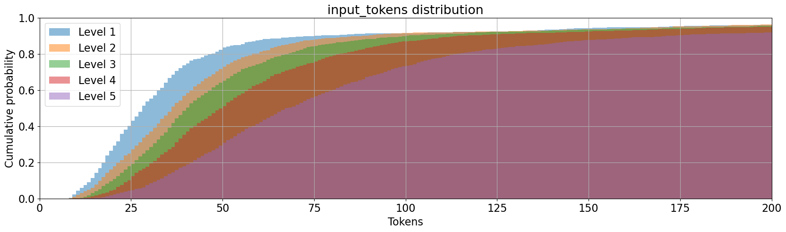
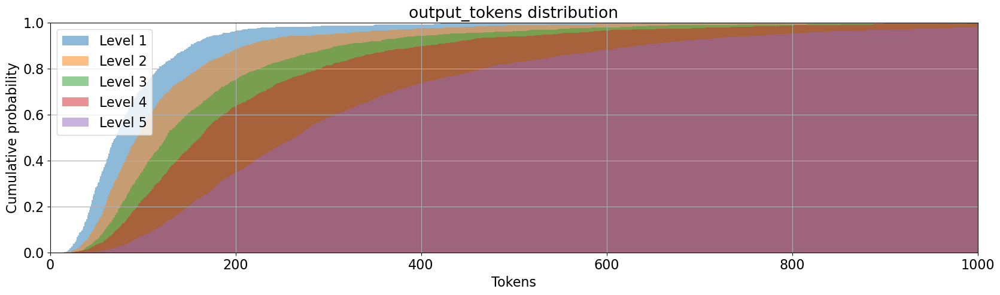
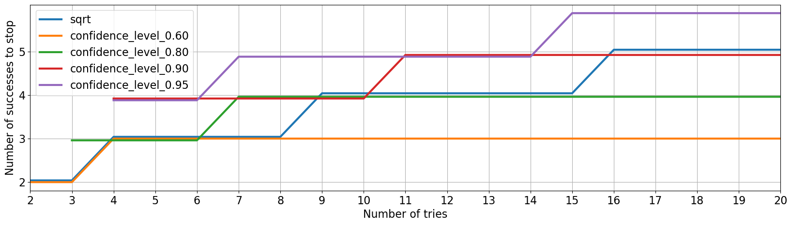
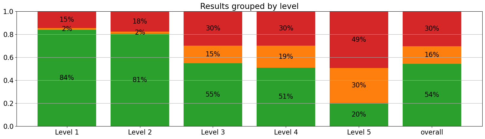

# Iteration 2. MATH dataset

_06/05/2024_

## Goal

Can we improve LB score by focusing on MATH dataset?

## Motivation

There is a [conversation](https://www.kaggle.com/competitions/ai-mathematical-olympiad-prize/discussion/499464) on the forum that suggests that the correlation between train score and
leaderboard score is very weak. The host said:

> 10 public problems were intentionally chosen to be at or above average difficulty. 50 test problems have a range of difficulties from relatively simple problems to those approaching national Olympiad level

This implies that claiming the overall prize winner is going to be very hard, because progress on the leaderboard
is not expected to be linear because the difficulty of the problems is increasingly harder.

Futhermore the train set is very small, just 10 problems. Using a bigger dataset for validation will
allow to measure small improvements.

## Development

### About the MATH dataset

MATH is a new dataset of 12,500 challenging competition mathematics problems. Each problem in MATH has a full step-by-step solution which can be used to teach models to generate answer derivations and explanations.

The problems belong to these categories: algebra, counting and probability, geometry, intermediate algebra, number theory, prealgebra and precalculus. They also have levels of difficulty from 1 to 5. The problems are
written in latex and they have also a text response in latex.

The proposed division has 7500 train problems and 5000 test problems. If I were to evaluate all the
test problems once using Kaggle's hardware it would take 90 hours (current submission takes 9 hours to solve 50 problems with 10 repetitions each). So this is a problem. Evaluation is slow. But it is a problem that
all the teams are going to have. And I could use my resources from consultant job to pay for computation.
The prize is 130k$, it might be worth spending a few thousand dollars in evaluation to get the prize.
But I have to first find something that works and is scalable.

Links:

- [Original repo of the MATH dataset](https://github.com/hendrycks/math?tab=readme-ov-file)
- [Kaggle dataset with MATH and GSM8K datasets](https://www.kaggle.com/datasets/alejopaullier/aimo-external-dataset)

#### Token len distribution





As expected the more difficult problems have longer answers and descriptions. Very beautiful graph.

#### Removing problems with non positive integer answers

I'm left with 4345 train problems and 2828 test problems. The distribution of problems is more or less
balanced except for level 1 that has half the problems than the other categories.

### Evaluating the MATH dataset

If making a single prediction per problem evaluating 566 test problems in 85 minutes. That is around 6 problems per minute.
GPU usage is high, so I don't think there is much room for improvement. I can run two evaluations in parallel
with good GPU usage.

Uncertainty in the results is big, f.e. for an accuracy of 54% the uncertainty is around 4%. Using the whole
test set will reduce the uncertainty below 2%, but evaluation would take 7 hours on my PC.

### About inference loop repetitions

Sometimes I have seen repetitions on inference, f.e. the following text was repeated multiple times:

```
We can then try each factor to see if it gives us a valid solution for $x$ and $y$.\n\nIf we try $10x + 15 = 1$, we get $10x = -14$, which is not possible since $x$ must be a positive integer.\n\nIf we try $10x + 15 = 2$, we get $10x = -13$, which is not possible.\n\nIf we try $10x + 15 = 7$, we get $10x = -8$, which is not possible.\n\nIf we try $10x + 15 = 14$, we get $10x = -1$, which is not possible.\n\nIf we try $10x + 15 = 49$, we get $10x = 34$, so $x = 3.4$, which is not an integer.\n\nIf we try $10x + 15 = 98$, we get $10x = 83$, so $x = 8.3$, which is not an integer.\n\nSo, we must have made a mistake somewhere. Let's go back and check our work.\n\nWe factored the left side of the equation as $(10x + 15)(y - 4) = 98$.\n\n
```

I have seen that Huggingface has tools such as [repetition_penalty](https://discuss.huggingface.co/t/transformers-repetition-penalty-parameter/43638) or `no_repeat_ngram_size`.

However using those options can be dangerous. In the response some tokens will be repeated very often, using a penalty on them will hurt the accuracy of the model. Documentation is not
clear and I believe it is better to play with the temperature of the model than touching
those parameters.

### Optimal stop criteria for self-consistency

On the public notebook that won the early prize the stopping criteria was `count > sqrt(n_tries`. When
I saw it I didn't liked and replaced it with a simpler majority check, f.e. if I was running 8 repetitions
I required the most voted answer to be 4 to stop sampling more answers. But I felt that it was not
a good allocation of resources.

I have implemented a better stop criteria based on statistics. My intuition says that I should
stop sampling more answers when the frequency of the most voted answer is statistically higher
than the second most voted answer. The beauty of this definition is that I can choose how much
statistical confidence I want to use: 80%, 90%, 95%...



I found this [paper](https://arxiv.org/html/2401.10480v1) about the topic, but didn't have the time to read it because I believe my approach
is the correct one.

### Speedup inference with P100 instead of 2xT4

Although using 2xT4 in parallel is likely to be faster than a a single P100, I could try using the P100
now because I know it is faster.

I have verified that when using 1024 output tokens on P100 I can use 1 or 2 shots, but using 3 or more
results on Out of Memory errors.

The inference speed is twice as 2xT4 as the information below shows.

```bash
P100 [19:05<00:00, 21.62s/it]
Correct: 18/53 (0.34 ± 0.13)
Unanswered: 0/53 (0.00 ± 0.00)
Wrong: 35/53 (0.66 ± 0.13)

T4x2 34/53 53/53 [42:16<00:00, 47.87s/it]
Correct: 21/53 (0.40 ± 0.13)
Unanswered: 0/53 (0.00 ± 0.00)
Wrong: 32/53 (0.60 ± 0.13)
```

It is a little bit weird because apparently the token speed generation was not so different ([18.7 vs 15.2](./Iteration_01_overfit.md#p100-vs-2xt4))

## Results

### First evaluations on MATH dataset

I have evaluated 1/5 of the test dataset in around 85 minutes.



The accuracy of the model decreases with the level of difficulty. Maybe I should focus on problems
of level 3 and above. The averaged accuracy of those categories is 42%, which equals to 21 problems solved
on the public leaderboard.

How an ideal validation set should be?

- As similar as possible to the test set. Correlation should be as high as possible. Improvements on the
  validation set should translate to improvements on the test set.
- The validation process should be as similar to the submission as possible. This implies that I should
  do many repetitions on each problem. Otherwise I won't be optimizing the same thing as in submission.
- As precise as possible. A small dataset with high uncertainty does not allow to measure small improvements.

This implies that I should select the levels with higher correlation to leaderboard, and use a lot of compute
to evaluate all the problems with a few repetitions.

### This challenge is a race in disguise

> In the event of a tie, the Submission that was entered first to the Competition will be the winner.

The private test set is tiny and thus uncertainty on the scores is very high. I have created a [notebook](https://www.kaggle.com/code/ironbar/uncertainty-private-test-score?scriptVersionId=176648016)
to estimate the effect of uncertainty.

A team with a score of just 22 will have a 30% chance of equaling or winning a team with a score of 25.
Luck will play a big role in the competition. And reaching a good score first will be very valuable.

However this is calculated with the assumption that all the problems have the same difficulty, which is likely untrue.


## Conclusion

## Next steps

- RAG to select the best shots for the prompt
- Prompt tuning to help the model use the correct output format

## TODO

- [x] How to evaluate the MATH dataset
- [x] What if I use the MATH dataset to create few-shot prompts for the train dataset?
- [x] Analyze evaluation results based on difficulty level, how do they correlate with LB score?
- [x] Use kaggle notebooks for evaluation, I have 30 hours per week.
- [ ] Evaluate on Veridas cluster?

- [ ] Study the effect of confidence level and repetitions on runtime and accuracy
- [ ] Measure effect of MathInstruct
- [ ] Is the number of shots relevant when using MathInstruct? Currently evaluating
- [ ] What is the effect of temperature?
- [ ] Does quantization affect to speed and accuracy? Currently measuring on Kaggle.
- [ ] How good are forum's prompts on my evaluation?
- [ ] Can I improve my LB score by using more repetitions with P100 gpu?
