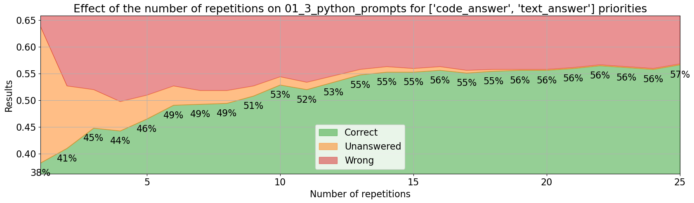
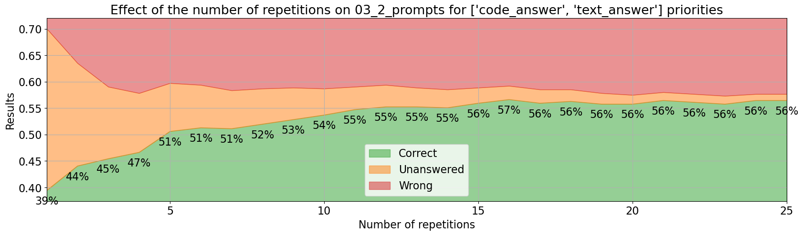

# Iteration n. Iteration_title

_24-05-2024_

## Goal

Can I improve the LB score with prompt engineering?

## Motivation

I'm going to leave the evaluation fixed: I'm going to use MATH level 5 problems (580) and I will be using 5 repetitions for each problem (confidence level 100%).

I want to try different prompt strategies:

- No code prompt
- Bad prompt
- Few-shot prompt
- Few-shot prompt with RAG
- Carefully crafted prompts

If the model is steerable by prompts I will be able to improve the LB score. If not
I will have to find another strategy.

I need to improve from my current 21 on LB score to 27, that is a +12% in accuracy that I need to get.

## Development

## Results

A total of 29 experiments have been run and the results can be seen on this [Google Sheet](https://docs.google.com/spreadsheets/d/1GgHY7C09sKe5qqVuubXWIYllxMZY5PWAHT54cc_NOIU/edit#gid=1082486122&range=A5).
All the experiments used 580 Math level 5 problems, 5 repetitions with the hope that the accuracy when
using 5 repetitions will correlate with the accuracy of using 25 or 30 repetitions.

| experiment                                     | correct | unanswered | wrong |
|------------------------------------------------|---------|------------|-------|
| public notebook prompts                        | 45%     | 5%         | 50%   |
| forced python public prompts                   | 48%     | 9%         | 44%   |
| custom prompt v1                               | 48%     | 8%         | 44%   |
| custom prompt v2 below                         | 47%     | 5%         | 48%   |
| custom prompt v3 list                          | 48%     | 5%         | 47%   |
| custom prompt v4                               | 47%     | 6%         | 47%   |
| cot no code                                    | 29%     | 3%         | 68%   |
| minimal prompt                                 | 28%     | 4%         | 68%   |
| AIMO train 2 shots                             | 52%     | 5%         | 43%   |
| AIMO train 4 shots                             | 52%     | 6%         | 42%   |
| MathInstruct 2 shots                           | 46%     | 6%         | 48%   |
| custom prompt v5 assistant                     | 50%     | 9%         | 41%   |
| custom prompt v6 easy                          | 49%     | 6%         | 45%   |
| custom prompt v7                               | 48%     | 7%         | 46%   |
| AIMO train 2 shots assistant                   | 52%     | 4%         | 45%   |
| AIMO train 2 shots assistant, forced python    | 51%     | 6%         | 43%   |
| MATHInstruct lv5 2 shots                       | 47%     | 5%         | 48%   |
| MATHInstruct lv5 2 shots RAG                   | 48%     | 5%         | 47%   |
| AIMO train 2 shots RAG                         | 48%     | 6%         | 46%   |
| AIMO train 2 shots assistant, T=0.2            | 48%     | 5%         | 47%   |
| AIMO train 2 shots assistant, T=0.7            | 51%     | 4%         | 45%   |
| AIMO train 2 shots assistant, T=0.9            | 50%     | 5%         | 45%   |
| AIMO train 2 shots assistant, T=20             | 52%     | 4%         | 44%   |
| AIMO train 2 shots assistant, T=0.7 top_p=0.5  | 51%     | 6%         | 43%   |
| AIMO train 2 shots assistant, T=0.9, top_p=0.5 | 51%     | 6%         | 43%   |
| custom prompt v8 program                       | 51%     | 8%         | 42%   |
| custom prompt v9                               | 28%     | 4%         | 68%   |
| 2 prompts                                      | 52%     | 7%         | 41%   |
| 5 prompts                                      | 50%     | 6%         | 45%   |

- The best results are obtained when using two prompts with the format proposed on [DeepSeekMath repo](https://github.com/deepseek-ai/DeepSeek-Math/tree/main/evaluation)

```
User: PROBLEM_PLACEHOLDER
Please reason step by step, and put your final answer within \\boxed{}. The answer is a non negative integer.

Assistant: Sure, we can solve the problem by writing a Python program.

```python

User: PROBLEM_PLACEHOLDER
Please integrate natural language reasoning with programs to solve the problem above, and put your final answer within \\boxed{}. The answer is a non negative integer.

Assistant: Sure, we can solve the problem by writing a Python program.

```python
```

- We observer drops in accuracy when code is not forced or used. So using code is crucial for this task
- Number of shots does not seem relevant
- Retrieval Augmented Generation (RAG) does not give significative improvements. Remember that in the
  DeepSeekMath paper they mention that the model is too small to benefit from few-shot prompting.
- The differences between the prompts that use code are very small, not significative
- The effect of temperature and top_p is uncertain in this evaluation

### Full evaluation

I have made a full evaluation with 31 repetitions using the two prompts shown in the previous section.
Unfortunately there is no significative improvement. It has an accuracy of 57%, just like using
the public prompts with python forcing. 





The new candidate improves the accuracy faster but leads to the same end result.

It seems again that we have to do full evaluation, we cannot do just 5 repetitions but we have to do 25.

### Multi-prompt full evaluation

I run a random search to combine multiple prompts from previous experiments. That search found a combination that
achieved an accuracy of 61% when mixing different prompts. However the result was optimistic because
I was selecting already done evaluations, thus I decided to run a realistic evaluation.

| confidence  | runtime (h) | accuracy |
|-------------|-------------|----------|
| 90%         | 27.7        | 59%      |
| 95%         | 29.1        | 57%      |

Reducing the confidence to 90% results on a minimal speedup, the accuracy is slightly higher but it is not
statistically significative. In theory using a higher confidence will lead to more stable and more
accurate results.

The results from this evaluation do not show significative improvements over previous experiments.
However it might have sense to use many different prompts to induce diversity in the responses since
we have seen that there are no big differences between good enough prompts.

## Conclusion

After a week and more than 20 experiments before I have not been able to improve LB score with prompt engineering. How could I improve?

- Using a better base model to generate answers. Fine-tuning DeepSeekMath may allow to do that.
  However people in the forum have said that they got worse results after fine-tuning. Remember that
  the model has already being trained with RL.
  It is uncertain if fine-tuning can improve the reasoning skills of a model.
- Change the generation process. Maybe giving as input already generated answers in a dialog between LLMs.
  Or we might give the possible answers to the model to choose between them, like in a test exam. [MMLU example](https://github.com/deepseek-ai/DeepSeek-Math/blob/main/evaluation/few_shot_prompts/cot_mmlu_stem_4_shot.py)
- Validate or verify the answers. I might discard wrong answers by validating them. Some problems might
  be easier to validate than others.
- Answer selection. Instead of relying on votes, I might use a model to select the best answer.
- Maybe rewriting the problem in a more clear way could help sometimes. I could create a dataset with rewritten problems and test the accuracy on it.

Score of 22 when increasing temperature to 0.9, it was luck because submitting the same version of the
notebook returned the following score distribution: `[21, 22, 18, 17, 15]`

## Next steps

- Reread the literature and better understand how DeepSeekMath model was trained
- Measure the effect of temperature with a higher number of repetitions

## TODO

- [x] How long does it take the evaluation with 5 repetitions? around 10 hours.
- [x] Prompts to evaluate
  - [x] CoT no code prompt
  - [x] Minimal prompt
  - [ ] ~~Bad prompt~~
  - [x] Few-shot prompt
  - [x] Few-shot prompt with RAG
  - [x] Temperature and top_p
  - [x] Prompt that uses code from the repo
  - [x] Ask the model to verify the answer. It ignores the request to verify the answer. If we want to do a verification we should do it manually.
- [x] Document results
- [x] Full evaluation with the best configuration
- [x] Analysis merging the results of all the evaluations
- [x] Can I find a better combination of prompts?
- [ ] I might drop the problems that do not receive any correct answer. This will allow to speedup evaluation.
- [x] Role of confidence, what if I decrease confidence from 0.95 to 0.9
