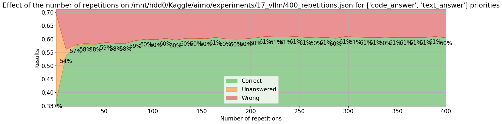
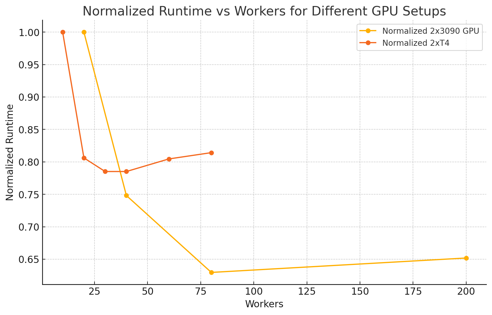

# Iteration 5. VLLM

_07-06-2024_

<!---
The work is done using short iterations. Each iteration needs to have a very
clear goal. This allows to gain greater knowledge of the problem on each iteration.
--->

## Goal

Can I speedup inference using [VLLM](https://github.com/vllm-project/vllm)?

## Motivation

If I can make a more efficient inference maximizing hardware utilization I might increase the number
of repetitions. If I can double the number of repetitions from 30 to 60 I may increase the accuracy by 5%.

## Development

### What is [VLLM](https://github.com/vllm-project/vllm)?

> A high-throughput and memory-efficient inference and serving engine for LLMs

It is open-source and it has an Apache-2.0 license.

> GPU: compute capability 7.0 or higher (e.g., V100, T4, RTX20xx, A100, L4, H100, etc.)

My intuition is that the highest throughput will be achieved using 2xT4, which is on that list.

One option would be to create a server and make http requests to it. This will decouple the use of GPU and
the inference logic completely, allowing to parallelize the inference completely.

Another option might be to use this class:

- https://docs.vllm.ai/en/stable/dev/engine/async_llm_engine.html
- https://github.com/vllm-project/vllm/issues/1200

### Using VLLM on Kaggle on T4 GPUs

T4 GPUs have 15360MiB according to Nvidia-smi, 3090s have 24576MiB. So that is 0.625 of the memory of
my home PC. I could use that value to simulate and experiment faster at home.

Loading model weights took 12.8725 GB

#### Quantization

- `fp8`, althought is documented it does not find that option on Kaggle, maybe there is a missmatch between versions
- `awq` -> ValueError: Cannot find the config file for awq
- `gptq` -> ValueError: Cannot find the config file for gptq
- `squeezellm` -> ValueError: Cannot find the config file for squeezellm


```
# when not using quantization and just a single worker I get this error
# maybe there is a problem with the installation of vllm
top_logprobs = prompt_logprobs + output.logprobs
TypeError: unsupported operand type(s) for +: 'NoneType' and 'NoneType'
```

If I install vllm directly from pip I have been able to make one succesfull inference. So maybe
the wheels are not correct.

#### Local runs

I'm able to run inference with just 62% of 3090 memory with 1 repetition.

When reducing gpu memory to 60% I get this error.
[rank0]: ValueError: The model's max seq len (1536) is larger than the maximum number of tokens that can be stored in KV cache (1104). Try increasing `gpu_memory_utilization` or decreasing `max_model_len` when initializing the engine.

- I need to make the processes robust to exceptions, and log them.
- Also remove tokenizer from code
- This local runs with lower memory will show me the speedup I could get on Kaggle.
- Maybe I will have to use a quantized model, that will allow to make batched inference.
- Probably using sort prompts will be better.

## Results

### Validation results

| repetitions | accuracy  | runtime (min) |
|-------------|-----------|---------------|
| 25          | 57%       | 219           |
| 100         | 59%       | 463           |
| 200         | 61%       | 830           |

I'm able to do an evaluation with 200 repetitions in 13 hours using the 2 gpus. Without
using VLLM I was able to do an evaluation with 25 repetitions in about the same time.
So we have achieved an speedup of x8 with the introduction of VLLM. The speedup is even
higher because previous evaluation had early stopping for each problem and I haven't implemented
that yet with VLLM (probably the speedup is close to x16).
This speedup comes from batching inferences and being able to parallelize the CPU and GPU execution.

We can observe a small increase in accuracy when using more repetitions.



It seems that with the current configuration after 200-300 repetitions there is no improvement.
Probably evaluating just by 100 repetitions should be enough to measure improvements very reliably.

### Leaderboard results

| repetitions | LB score                    |
|-------------|-----------------------------|
| 30          | 16, 17, 18, 18, 18, 19, 20  |
| 200         | 18, 18, 18, 19, 20, 21      |

On submission I have been able to increase the repetitions from 30 to 200. Thus we see a similar
speedup.

It is unclear if we have improved. The min score is higher

### Optimal number of workers



For Kaggle 30 workers will be fine, maybe 20 even better if I implement early stopping.

My PC is more powerful and 80 workers is a good choice.

## Conclusion

I have been able to speedup inference with a factor higher than x8, but it is unclear if the LB score has improved.

With 21 problems solved in the luckiest submission we are still far from the top team which is is able to solve 27 problems which is much better (42% vs 54%).

## Next steps

- Maybe some advanced inference like speculative decoding might improve the results? I'm not sure what it is but VLLM has some parameters for that. I have done a quick search and it is to use a small model in combination
  with a bigger model to be more efficient on inference. In other article it seems to be to predict multiple tokens at once.
- Can I reduce inference time using early stopping confidence in the decision? Probably, but that is not expected to bring improvements.
- Maybe playing with the temperature, increasing the temperature on each step?
- What if I use a different model on each server? The RL and the instruct versions of DeepSeekMath

## TODO

- [x] Refactor current code to make room for VLLM
- [x] What would be the max seq len available at Kaggle? It seems to be capable of handling 1536 [evaluation](https://www.kaggle.com/code/ironbar/vllm-with-code-interpreter?scriptVersionId=183030249)
  I haven't seen any problem when increasing the max output tokens from 640 to 896. Neither when adding few-shot prompting (with 1 example).
