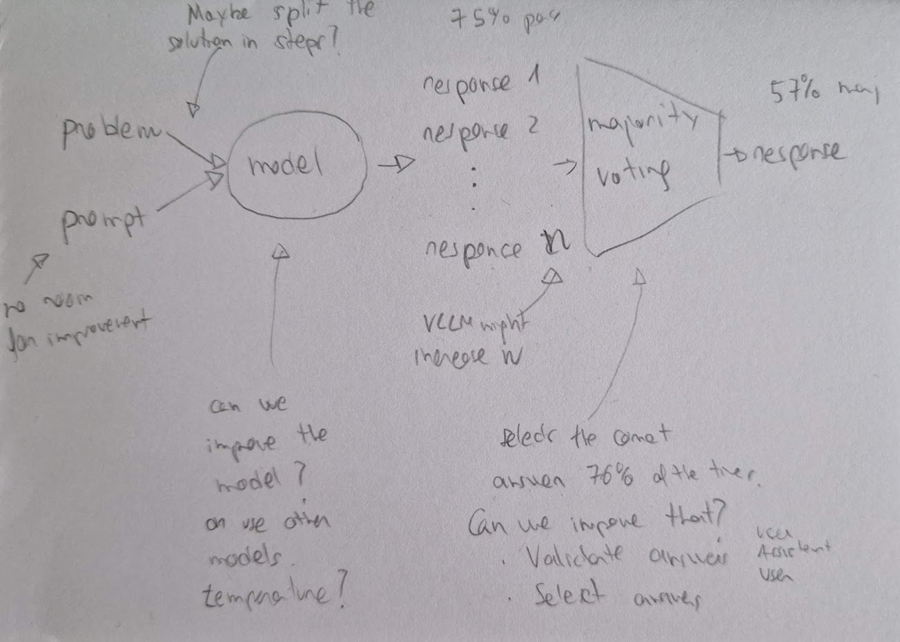

# Iteration 9. Giving hints to the model

_17/06/2024_

## Goal

Can we improve the accuracy of the model by giving hints of how to solve the problem?

1. Does the model improve if being given hints?
2. Can I automate the process of giving hints?

## Motivation

I have explored almost all ideas:

- Using VLLM to speedup inference. Inference was much faster but results didn't improve.
- Could not fine-tune the model to be more accurate
- Could not make the model to validate or select the correct answer
- Using the instruct model in an ensemble with the RL model did not improve

So today I was re-reading the forum and read some comments about how brittle the model is. Changing
small parts of a problem results in very different inferences. So maybe we can use that in our favour.

## Development

On a first step I'm going to take problems where the model is struggling to solve them. Since the
MATH dataset has solutions I could use them for inspiration to give hints to the model. I will
measure how much the model improves and if it is promising I will have to find a way to automate
the process of giving hints.

## Results

- Some problems are better solved without using code.
- Adding that the answer is a non negative answer might be harmful
- Sometimes reason step by step works worse than simply giving the problem as input
- Hints do not seem to work too well

Following this tips I have run a new validation with simpler prompts, some of them without python forcing and
I get the same accuracy of 59% of previous configurations.

However when making a submission it seems to be slightly better than previous prompts.

| prompts          | LB score                   | mean LB score |
|------------------|----------------------------|---------------|
| multiple prompts | 18, 18, 18, 19, 20, 21     | 19.0          |
| simpler prompts  | 19, 19, 20, 20, 20, 20, 21 | 19.9          |

## Conclusion

I have found that some problems are better solved without code and even without chain of thought.

## Next steps

Select the final submissions

## TODO

- [x] Prompts without python code
- [x] What if I remove references to the answer being non negative? I could later discard negative values. If the model is brittle that might help.
